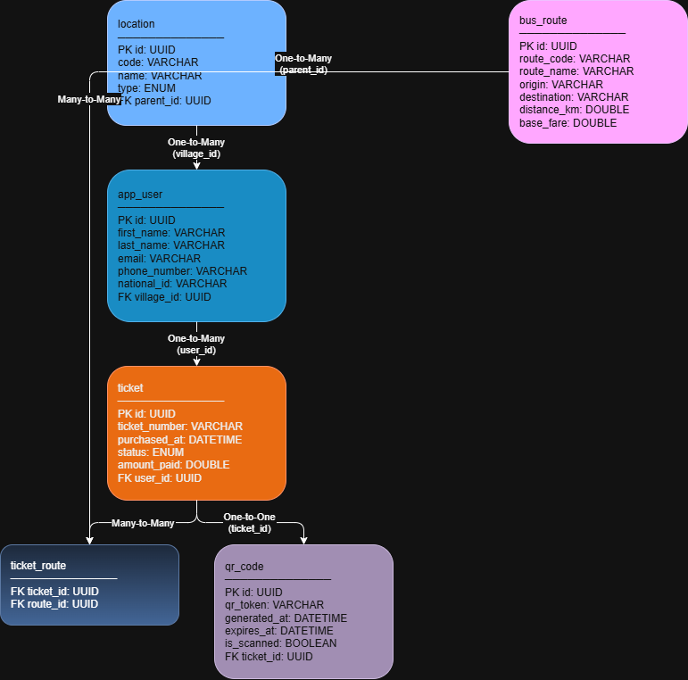

# 🚌 IGENDABUS SMART
### Digital Bus Transportation System
> A Spring Boot REST API that allows passengers to scan QR codes, pay fares, and board buses quickly and securely.

---

# 🚌 IGENDABUS SMART
### Digital Bus Transportation System
> A Spring Boot REST API that allows passengers to scan QR codes, pay fares, and board buses quickly and securely.

---

## 👤 Student Information
| Field | Details |
|---|---|
| **Name** | KAMANZI Milliam |
| **ID** | 27523 |
| **Group** | C |

---
---

## 📊 Entity Relationship Diagram (ERD)


---

## 🗄️ Database Tables (6 Tables)
| Table | Description |
|---|---|
| `location` | Rwanda admin structure (Province→District→Sector→Cell→Village) |
| `app_user` | Passengers registered in the system |
| `bus_route` | Available bus routes (e.g. Kigali→Musanze) |
| `ticket` | Purchased tickets by passengers |
| `ticket_route` | Join table for Many-to-Many (Ticket ↔ BusRoute) |
| `qr_code` | Auto-generated QR code per ticket |

---

## 🔗 Database Relationships
| Relationship | Between | How |
|---|---|---|
| Self-referencing One-to-Many | Location → Location | `parent_id` column |
| One-to-Many | Location → User | `village_id` in app_user |
| One-to-Many | User → Ticket | `user_id` in ticket |
| Many-to-Many | Ticket ↔ BusRoute | `ticket_route` join table |
| One-to-One | Ticket ↔ QRCode | `ticket_id` in qr_code |

---

## 🌍 Rwanda Location Structure
Users are saved using **only their Village name or code**.
Because of the self-referencing relationship, the system automatically links them to:
```
Village → Cell → Sector → District → Province
```

---

## 📡 API Endpoints

### 📍 Location Endpoints
| Method | URL | Description |
|---|---|---|
| POST | `/api/locations/save` | Save a Province |
| POST | `/api/locations/save/child?parentId=UUID` | Save District/Sector/Cell/Village |
| GET | `/api/locations/all` | Get all locations |

### 👤 User Endpoints
| Method | URL | Description |
|---|---|---|
| POST | `/api/users/save?villageNameOrCode=Amahoro` | Save user by village |
| GET | `/api/users/all?page=0&size=10&sortBy=firstName` | Get all users (paginated + sorted) |
| GET | `/api/users/{id}` | Get user by ID |
| GET | `/api/users/province/code?provinceCode=KG` | Get users by province code |
| GET | `/api/users/province/name?provinceName=Kigali` | Get users by province name |

### 🚌 Bus Route Endpoints
| Method | URL | Description |
|---|---|---|
| POST | `/api/routes/save` | Save a bus route |
| GET | `/api/routes/all?page=0&size=10&sortBy=routeName` | Get all routes (paginated + sorted) |
| GET | `/api/routes/{id}` | Get route by ID |

### 🎫 Ticket Endpoints
| Method | URL | Description |
|---|---|---|
| POST | `/api/tickets/buy?userId=UUID&routeIds=UUID` | Buy ticket + auto-generate QR code |
| GET | `/api/tickets/all?page=0&size=10&sortBy=purchasedAt` | Get all tickets (paginated + sorted) |
| GET | `/api/tickets/user/{userId}` | Get tickets by user |

---

## ⚙️ How to Run

### Prerequisites
- Java 17+
- PostgreSQL
- Maven

### Steps
1. Clone the repository:
```bash
git clone https://github.com/Kamanzimilliam/midterm_27523_groupC.git
```
2. Create the database:
```sql
CREATE DATABASE igendabus_smart_db;
```
3. Update `application.properties` with your PostgreSQL password
4. Run the application:
```bash
./mvnw spring-boot:run
```
5. API runs at: `http://localhost:8080`

---

## 🔑 Key Implementations

### existsBy() Methods
```java
Boolean existsByCode(String code);       // LocationRepository
Boolean existsByEmail(String email);     // UserRepository
Boolean existsByRouteCode(String code);  // BusRouteRepository
Boolean existsByTicketNumber(String n);  // TicketRepository
```

### Pagination + Sorting
```java
Pageable pageable = PageRequest.of(page, size, Sort.by(sortBy).ascending());
return userRepository.findAll(pageable);
```

### Province Query
```java
@Query("SELECT u FROM User u WHERE u.village.parent.parent.parent.parent.code = :provinceCode")
Page<User> findUsersByProvinceCode(@Param("provinceCode") String provinceCode, Pageable pageable);
```